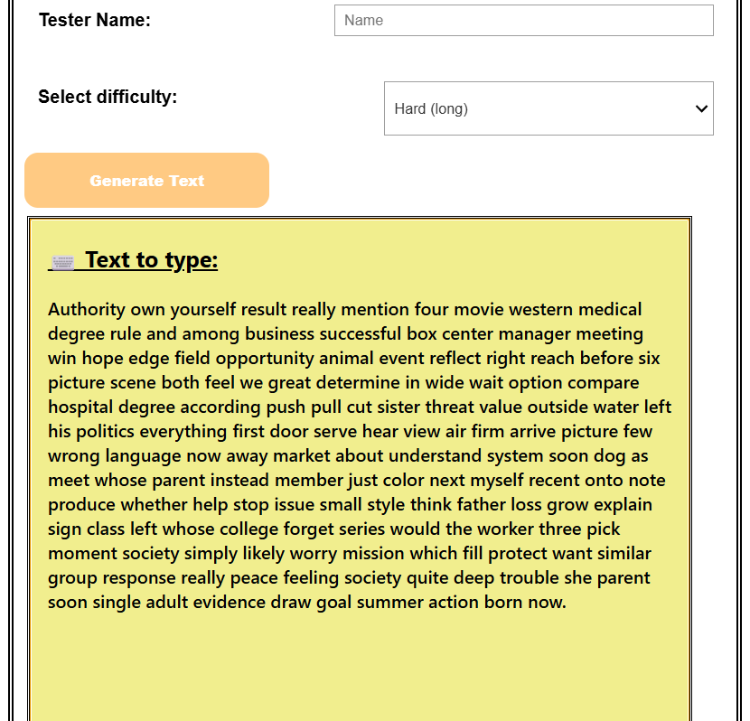
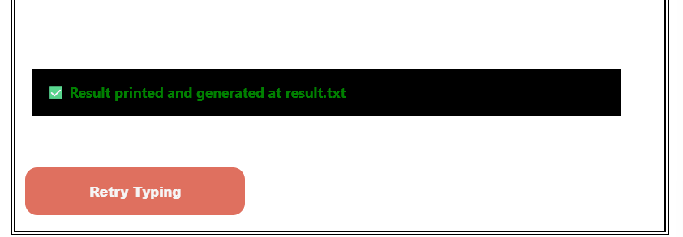

# ⌨️ Typing Test v1.0 (Python, Jupyter GUI)

A fully interactive typing test built with Python and Jupyter Widgets. Tracks WPM, accuracy, and mistyped characters. Includes dynamic UI, difficulty selection, result saving, and retry functionality.

---

## 📁 Project Structure
<pre>
├── main.ipynb # Jupyter Notebook to launch the GUI of core typing test program
├── main.py # .py file for GUI support 
├── utils.py # Helper functions (label_generator, random_text_generator)
└── README.md # This README file </pre>

## 🚀 How to Use
### ✅ Option 1: Run via Jupyter Notebook (GUI)

1. Launch Jupyter Notebook in this project directory.
2. Open main_notebook.ipynb (or copy code into a new notebook).
3. Run all cells.
4. Interact with the GUI to:
    - Enter your name
    - Choose a difficulty level
    - Generate typing text
    - Begin typing
    - Press Ctrl + Shift + Enter to submit

## Features
 - 📋 Name input for personalized results
 - 🔁 Retry button to improve your score
 - ⚙️ Difficulty selector (easy, normal, hard)
 - 📝 Real-time typing area
 - 🕒 Timer starts automatically when typing begins
 - 💬 Detailed results:
    - WPM (Words Per Minute)
    - Accuracy (% match)
    - Mistyped characters with indexes
 - 💾 Saves results to a text file in a results/ folder
 - 📂 Automatically appends numbers to filenames if they already exist (e.g., result.txt, result(1).txt, etc.)

## 📁 Saved File Format

Each time you submit your result, a file is saved to the results/ directory in the format:
 - WPM: 53.45, Accuracy: 97.88%, Time: 30.25s
 - Total of wrong characters: 3
 - Wrong characters (index): [(5, 'e', 'r'), (12, 'l', 'k'), (22, ' ', '.')]
 - Time Created: 2025-08-29 12:33:20.451237

#### GUI Snippet

## 🧰 Tech Used
 - Python 3.6+
 - Jupyter Notebook
 - Libraries:
     - ipywidgets
     - ipyevents
     - IPython.display
     - pathlib
     - datetime
     - Custom utils.py

© Author
Created by KB Garcia.